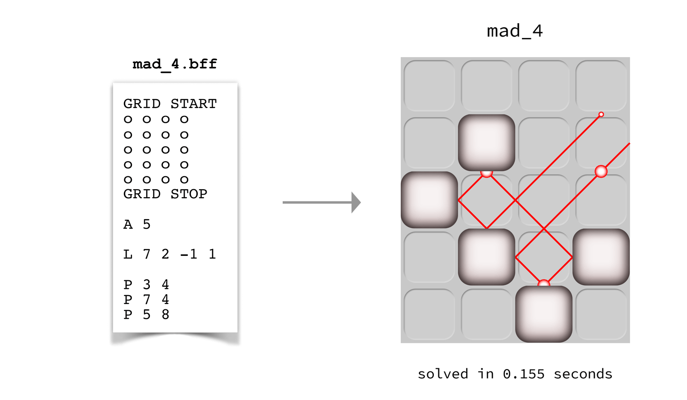
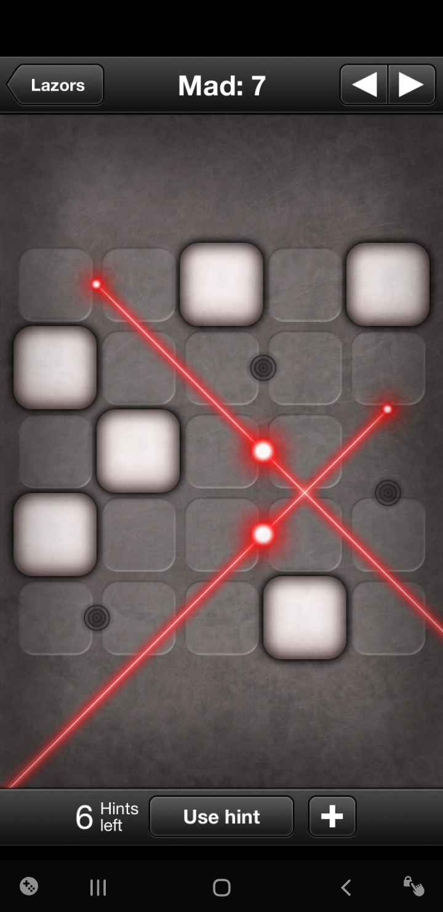
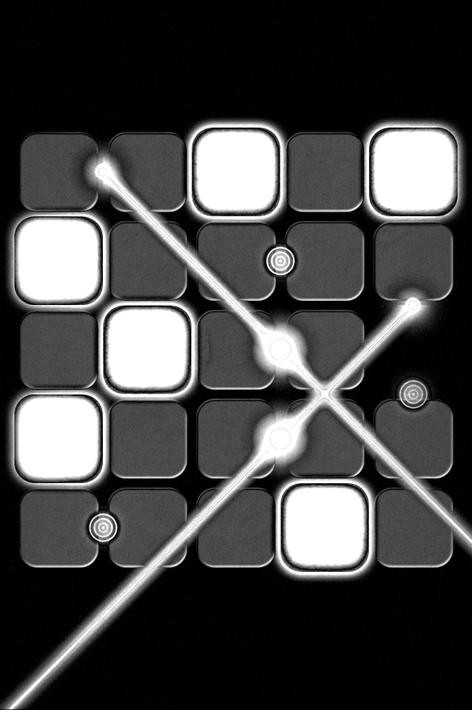
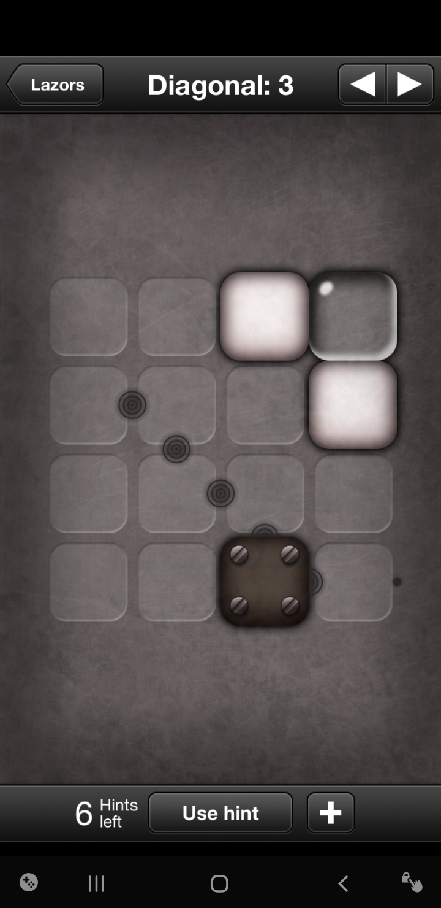
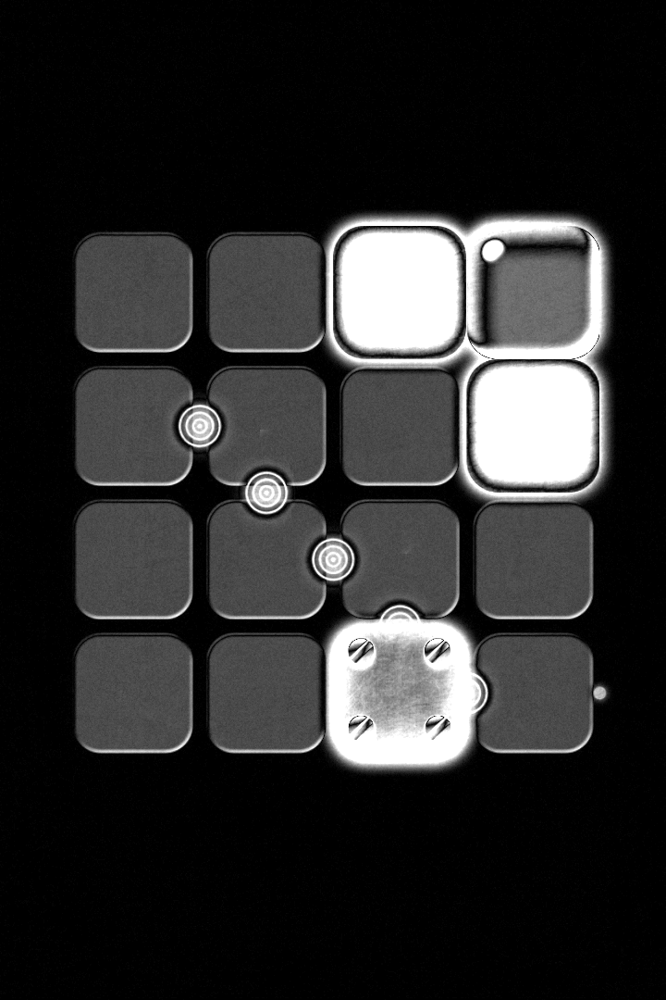

# lazor_solver
module to solve for board puzzles of the "Lazors" game in Android and iOS




## Requirements

- Python 3.6 or higher
- `numpy` and `Pillow`


## Tested environment
- Python 3.7.3 with `numpy (v1.15.2)` and `Pillow (v5.4.1)`
- Python 3.6.7 with `numpy (v1.16.2)` and `Pillow (v6.0.0)`


## Usage

You can use this project by running the batch script directly, or import `pylazors` as a module in your own codes.

### Using batch script `lazors.py`

You can solve all board files given in the handout by running:
```bash
$ cd lazor_solver
$ python3 lazors.py
```

When running, the script `lazors.py` will create a `solutions` folder, import and solve all `.BFF` inside 
`boards/handout`, and write solutions as `.PNG` files in `solutions` folder.

You can uncomment the last line in `lazors.py` to also solve all boards in `boards/all` in parallel as well.

### Using `pylazors` module

The `pylazors` module contains classes and functions that can be used to read and write a board, and solve a board. Here is a simple example:
```python
import pylazors

# Import .BFF file as a <pylazors.Board> object
board = pylazors.read_bff('boards/handout/dark_1.bff')

# Solve board
solution = pylazors.solve_board(board)

# Write solution as an image
pylazors.write_png(solution, 'solutions/dark_1.png')
```

## Unit tests

You can run all unit tests by:
```bash
$ cd lazor_solver
$ python3 -m unittest discover -s tests 
```

## Underdevelopment

  - Image loader of board to solve
    the initial image processessing can yield the following, wondering if Template Matching can work here?

   ---> 


   ---> 


## Performance

Following performance benchmarks were obtained using an eight-core 4.0 GHz processor.

#### Serial

- for 8 boards in `boards/handout`:

    ```
	total wall time: 7.02 seconds.
	total CPU time:  6.441 seconds (min/avg/max 0.004/0.805/3.513).
	5 slowest boards: yarn_5 (3.5s), mad_7 (2.4s), showstopper_4 (0.2s), mad_4 (0.1s), numbered_6 (0.1s)
    ```

- for 157 boards in `boards/all`:

    ```
	total wall time: 415.08 seconds.
	total CPU time:  403.748 seconds (min/avg/max 0.000/2.572/129.844). 
	5 slowest boards: showstopper_9 (129.8s), grande_10 (80.1s), diagonal_10 (66.9s), showstopper_10 (33.4s), grande_9 (10.8s)
    ```

#### Parallel (using 8 processes)

- for 8 boards in `boards/handout`:

    ```
	total wall time: 3.62 seconds.
	total CPU time:  6.506 seconds (min/avg/max 0.002/0.813/3.503).
	5 slowest boards: yarn_5 (3.5s), mad_7 (2.4s), showstopper_4 (0.2s), mad_4 (0.2s), numbered_6 (0.1s)
    ```

- for 157 boards in `boards/all`:

    ```
	total wall time: 136.92 seconds.
	total CPU time:  455.573 seconds (min/avg/max 0.000/2.902/136.804).
	5 slowest boards: showstopper_9 (136.8s), grande_10 (88.0s), diagonal_10 (74.2s), showstopper_10 (39.5s), grande_9 (13.8s)
    ```
