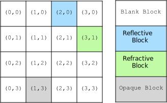
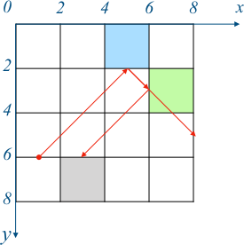

# Notes on Optimization in `_solver.py`

## 1. Board coordinate systems

There are two different coordinates systems inside `pylazors.Board`, one for blocks, and another one for laser and target points. 

The  coordinate system for blocks start from top-left as `(0, 0)`, and its step size is by one block. As shown in following example.



The coordinate system for laser and target points also start from top-left as `(0, 0)`, but its step size is by half block. As shown in following example, the laser source is at `(1, 6)` and its direction is `(1, -1)`.



### 2. Laser tracing

Laser tracing starts with a queue contains all untraced laser sources. At each iteration, one laser is popped from that queue.

Under these two coordinate systems, for any laser source starting from `(x, y)` with a direction in `(vx, vy)`, the next block on the path of the laser will be at position `(bx, by)` :

```python
hx, hy = x // 2, y // 2  # arbitrary variables
bx, by = (hx - (0 if vx > 0 else 1), hy) if y % 2 else (hx, hy - (0 if vy > 0 else 1))
```

- If the block at `(bx, by)` is transparent (it could be `Block.BLANK` or  `Block.REFRACT`), a segment of laser path is stored, and a new laser source is created and append to the queue.

  ```
  new_segment (x0, y0, x1, y1) = (x, y, x + vx, y + vy)
  new_laser (x', y', vx', vy') = (x + vx, y + vy, vx, vy)
  ```


- If the block at  `(bx, by)` is reflective (it could be `Block.REFLECT` or  `Block.REFRACT`), a new laser source is created and append to the queue.

  ```
  new_laser (x', y', vx', vy') = (x, y, -vx, vy) if y % 2 else (x, y, vx, -vy)
  ```

### 3. Combination generator

The generator contains three nested `for` loops, each one iterates through all possible location combinations of one type of blocks (first on opaque blocks, then on reflect blocks, and last on refracting blocks).

After each combination are generated using `itertools.combinations`, a few quick tests are performed. If any of those tests failed, the generator would skip to the next combination, instead of returning it and waste time on the `_trace_lasers ` function.

In the outer `for` loop for opaque blocks, two tests are performed:

- If there is only one laser source, then no opaque block can be placed right after that laser source. Since it will terminate the only laser source directly.
- Any two opaque blocks cannot be placed together so that they will surround a target point, such that there is no way a laser can reach that target point.

In the middle `for` loop for reflect blocks, one test is performed:

- Any two opaque or reflect blocks cannot be placed together so that they will surround a target point, such that there is no way a laser can reach that target point.

These quick tests can save time by skipping lots of expansive `_trace_lasers ` calls. Here is the result of a benchmark of solving all the boards in *Lazors* game:

|                | Total time used | Average time per board | Total `_trace_lasers  ` calls |
| :------------: | :-------------: | :--------------------: | :---------------------------: |
|  **No tests**  |  1592.405 sec   |       10.143 sec       |          79,578,836           |
| **With tests** |   732.311 sec   |       4.664 sec        |          23,039,788           |

From the result, we can see that three simple tests can reduce the total number of  `_trace_lasers ` calls by more than 70%. And the average time used per board is reduced by more than 50%. 

There are also limitations to this method. First is that if for a specific board, very fewer combinations can be skipped from those test, this method will have almost no effect, or even degrading performance, since performing those tests adds a constant time in each iteration. Also, the speedup differs from board to board. The following table contains timing information for five slowest boards to solve.

|                | diagonal_10 | grande_9 | grande_10 | showstopper_9 | showstopper_10 |
| :------------: | :---------: | :------: | :-------: | :-----------: | :------------: |
|  **No tests**  |  126.3 sec  | 21.6 sec | 138.4 sec |   732.3 sec   |   414.9 sec    |
| **With tests** |  117.9 sec  | 22.1 sec | 142.1 sec |   250.4 sec   |    69.3 sec    |
|    Speedup     |   6.65 %    | -2.31 %  |  -2.67 %  |    65.80 %    |    83.30 %     |

For such reasons, the solver functions in `_solver.py` is only used when the size of the input board exceeds a certain threshold.